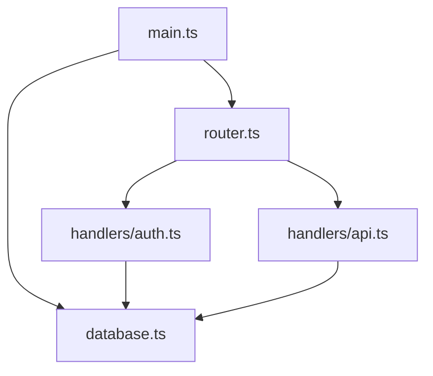

# Codebase Visualizer

Generate visual representations of the codebase to understand structure and relationships.

## 1. Directory Tree Analysis

Scan the project and produce a structured overview:
- File count and size by directory
- File type distribution
- Identify the heaviest directories
- Map the project layout with annotations

## 2. Dependency Graph

Analyze imports/requires across the codebase:
- Map module dependencies (which files import which)
- Identify circular dependencies
- Find orphan modules (imported by nothing)
- Highlight high-fanout modules (imported by many)

Output as ASCII or Mermaid diagram:


## 3. Architecture Diagram

Generate a layered architecture view:
```
┌─────────────────────────────────────┐
│           Presentation Layer         │
│  (components, pages, views)          │
├─────────────────────────────────────┤
│           Application Layer          │
│  (services, use-cases, controllers)  │
├─────────────────────────────────────┤
│            Domain Layer              │
│  (models, entities, value objects)   │
├─────────────────────────────────────┤
│         Infrastructure Layer         │
│  (database, API clients, adapters)   │
└─────────────────────────────────────┘
```

## 4. Git History Visualization

Analyze the repository history to identify:
- Most frequently changed files (hotspots)
- Files that change together (coupling)
- Complexity trends over time
- Author contribution patterns

## Usage

When invoked, ask what type of visualization:
1. **Structure**: Directory tree with statistics
2. **Dependencies**: Import/export relationship graph
3. **Architecture**: Layered system diagram
4. **Hotspots**: Git history analysis
5. **All**: Comprehensive overview

Prefer Mermaid diagrams for renderability. Fall back to ASCII art when Mermaid is not suitable.
